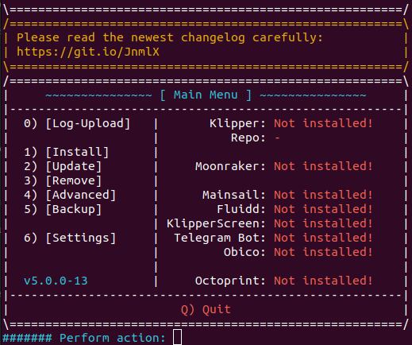
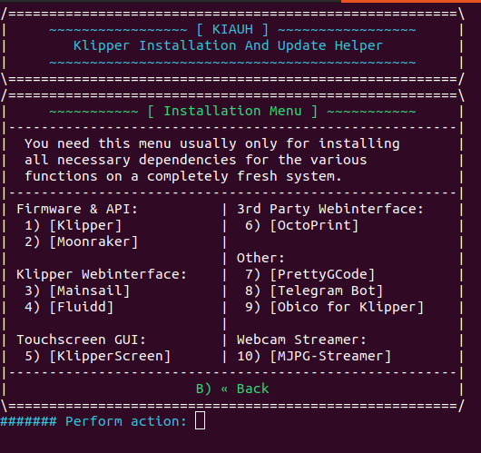

# Klipper-for-TronXY-X5SA-STM446-mainboard
A simple guide for installing Klipper on your TronXY X5SA with an STM32F446 chip

# Required hardware:
- Pi/computer running Pi OS Lite or any other debian branch
- Usb cable to connect to the printer
- 32GB or less sd card, I used the 8GB card that came with the printer

# Installing Klipper onto the Pi/ Linux computer using KIAUH
Check out the KIAUH repo for more detailed instructions: https://github.com/th33xitus/kiauh

SSH into your Pi or other computer and run
```
sudo apt install git 

cd ~

git clone https://github.com/th33xitus/kiauh.git

./kiauh/kiauh.sh
```
After you run all of those, your terminal should look similar to this:



Next, type in "1" to get to the install page.



Install Klipper, Moonraker, and Mainsail or Fluidd

# Installing Klipper firmware onto the printer

Go to this repo's directory: firmware and download the fmw_x5sa.bin file.

Insert the SD card that you want to use to flash the printer into your pc.
Make sure that it is completely empty.

Create a folder and name it "update". Put the fmw_x5sa.bin file into that folder.

Eject the SD card, and turn off your printer. 

Insert the SD card into the printer, and turn it on. The screen should get stuck on something like the image below:

